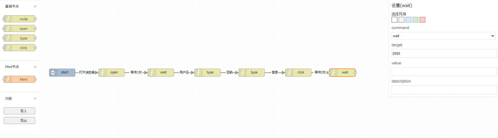
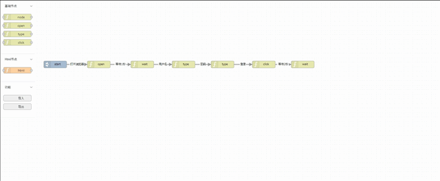

## how to install

folder structure:
```
auto-test
│  auto-server.bat
│  target\auto-test.jar
│  driver
│  conf
```

1. Java 17 or newer is required.
2. set AUTO_TEST_HOME to environment, default is the folder of auto-test.
3. download webdriver, and put it in `driver` directory.
   - [chrome](https://chromedriver.chromium.org/downloads) for chrome115 or newer [chrome-for-testing](https://googlechromelabs.github.io/chrome-for-testing/)
   - [edge](https://developer.microsoft.com/en-us/microsoft-edge/tools/webdriver/)

## how to run

- start auto-server.bat to start the server, and then run the test cases xlsm.
  there is an example file [[case_template.xlsm]] in [testcases_example](doc%2Ftestcases_example) directory.

  local server url：[http://localhost:9191](http://localhost:9191)

- use auto-test.bat to run the test.
```
Usage: auto-test [options]
  Options:
    -b, --baseDir
      base directory of the program.
    -c, --cases
      the test cases to be executed, split by comma. eg. 1-2,13
    -f, --file
      the test case file to be executed, specific absolute path,  if relative
      path, it will look for the file in the work directory.
    -h, --help
      help message
    -m, --mode
      test mode, default is xlsx, optional: xlsx, csv, json.
    -d, --workDir
      work directory to store test case file and test result file.
```

## screenshots

- design test cases in web ui



- execute test cases in web ui



## commands.md

refer to [commands](doc/commands.md) for the commands supported by auto-test.
