## side mode

- install selenium ide

  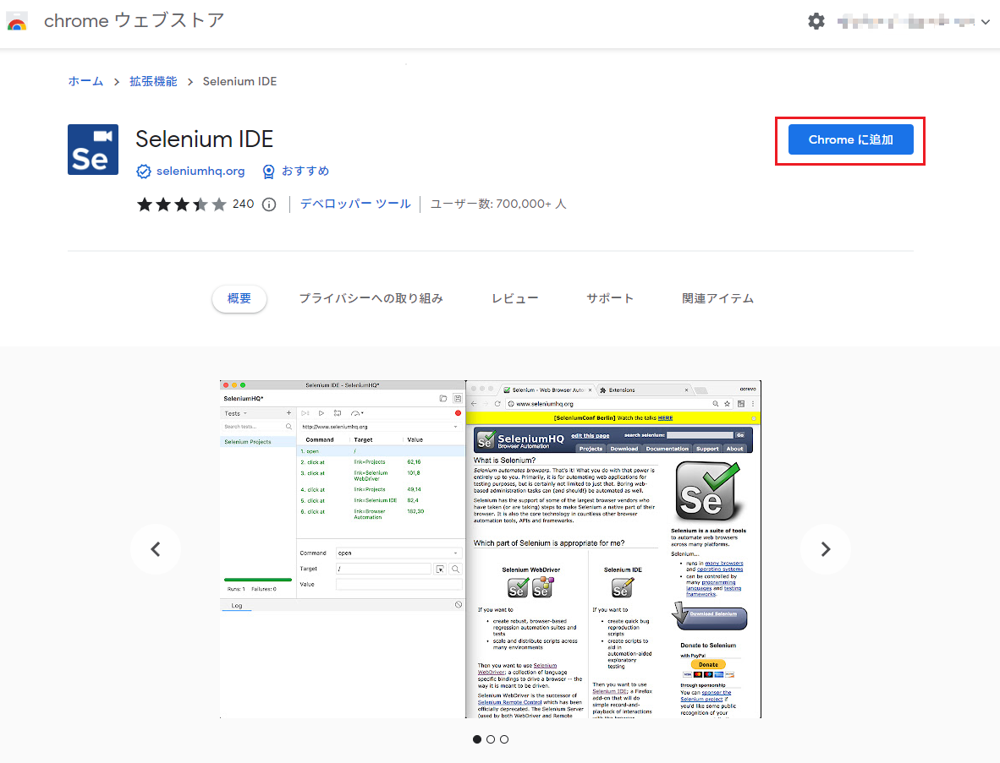

- recording test case with selenium ide

  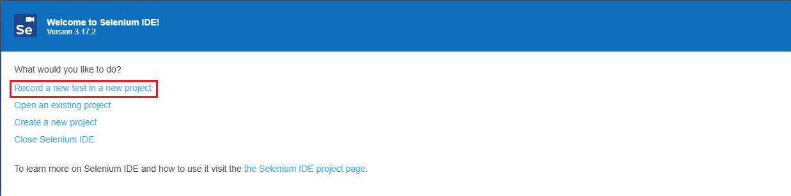

- test case name

  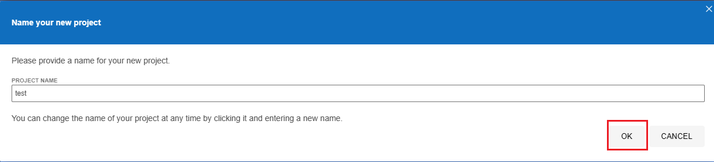

- input base url

  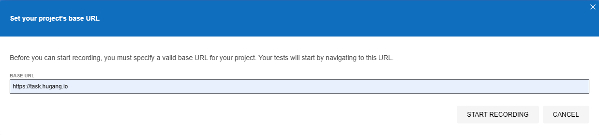

- recording test case

  
  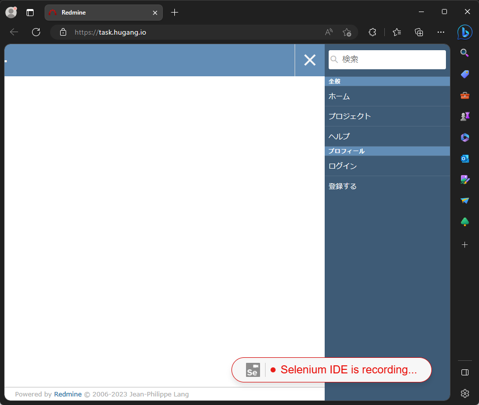
  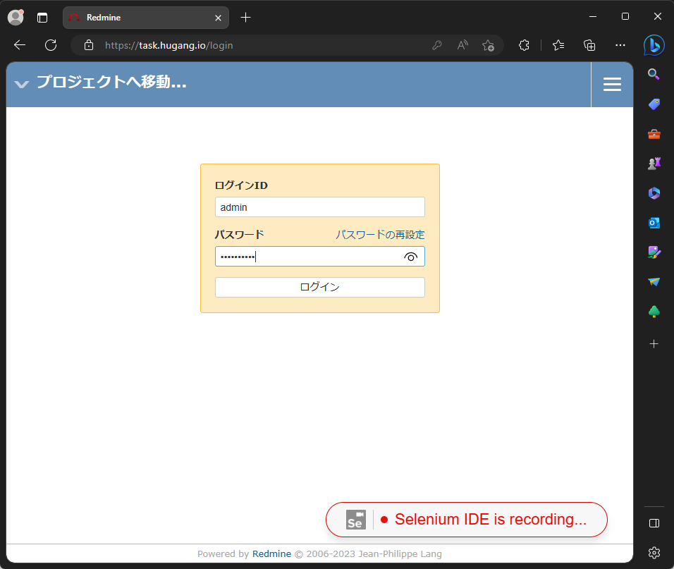
  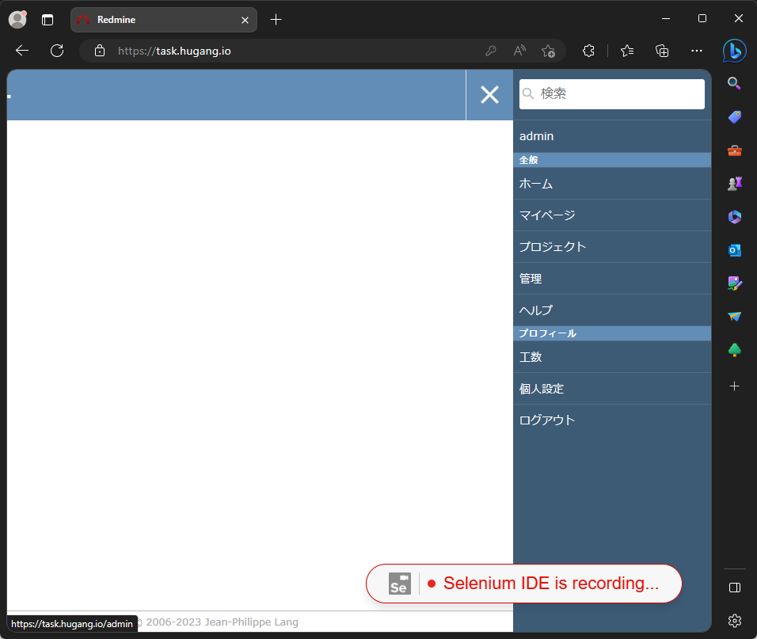
  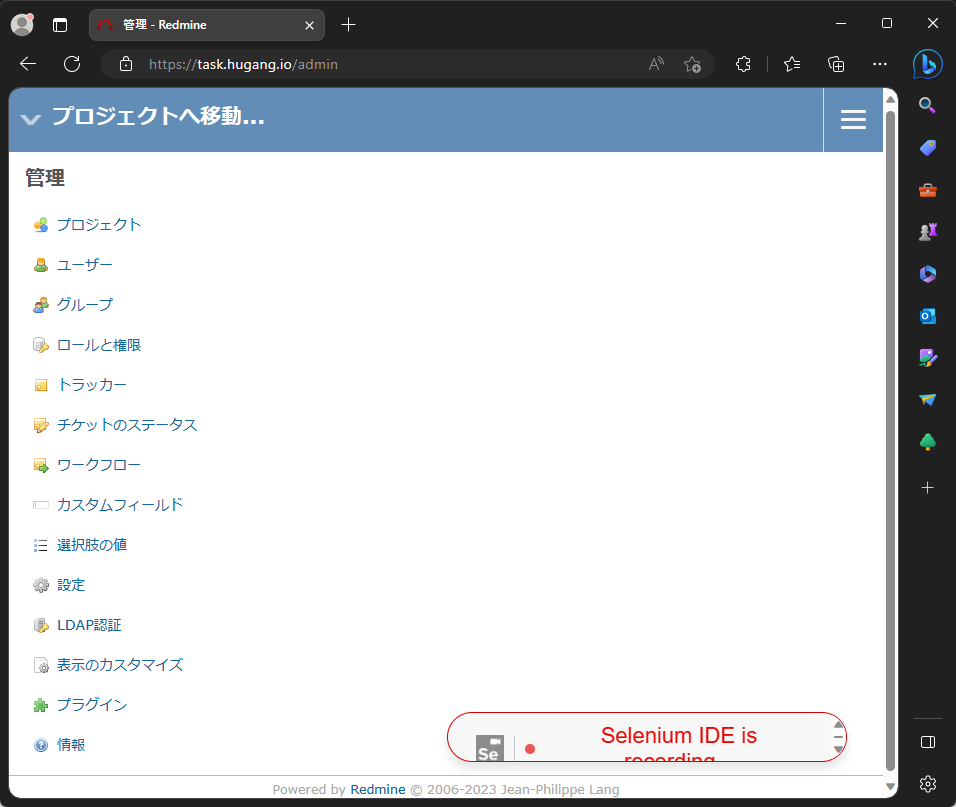

- save test case

  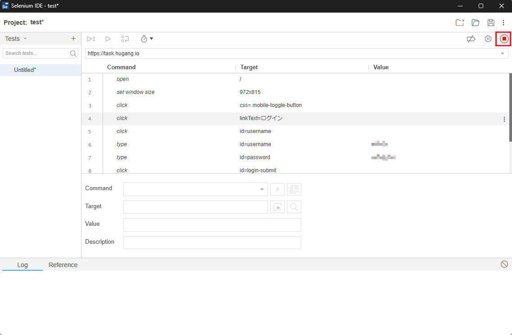
  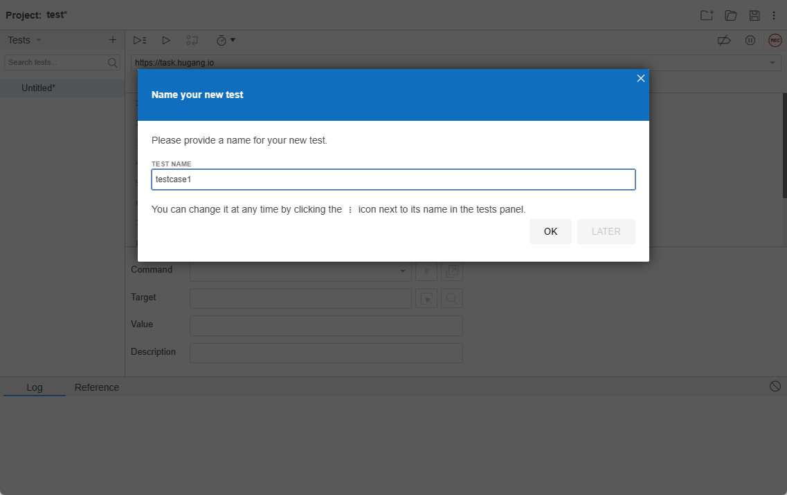
  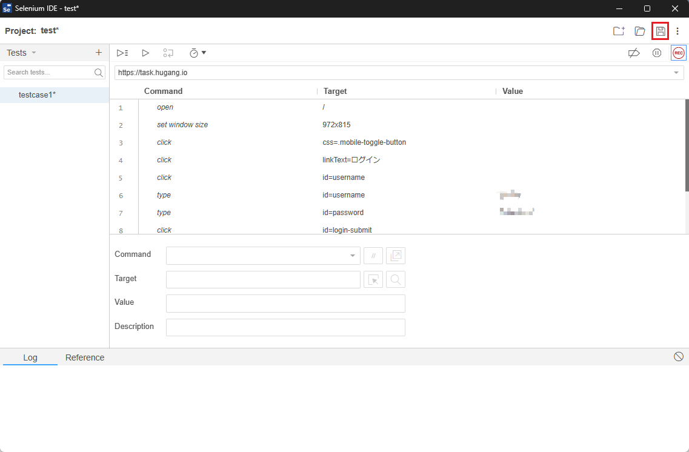
  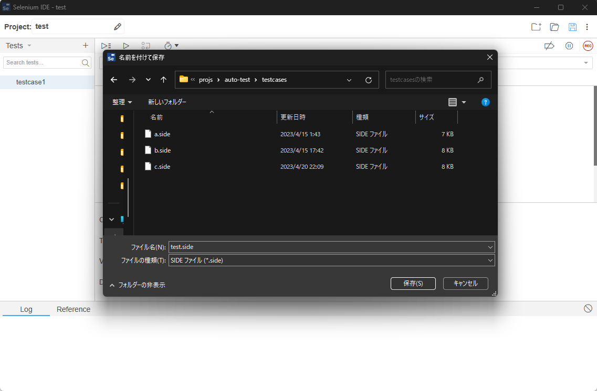

- modify user.properties to use side mode and set side file path

  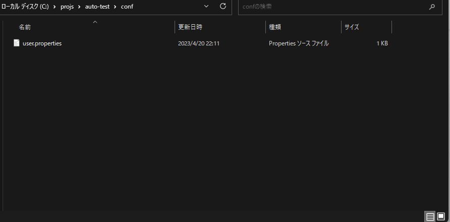
  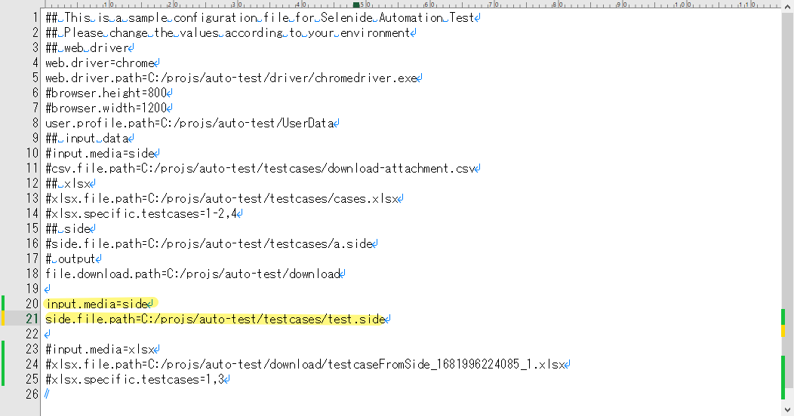

- run auto-test.bat, the step will execute the side file, and generate a xlsx template for customizing test data 

  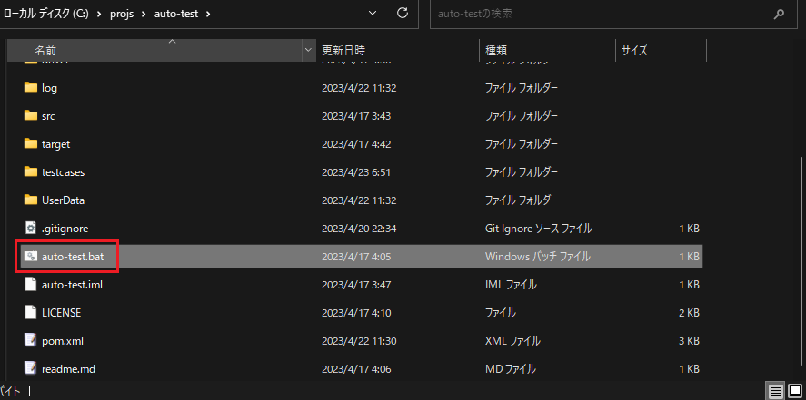
  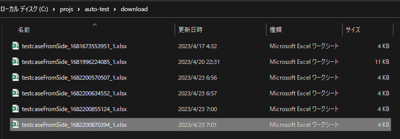
  

- result

