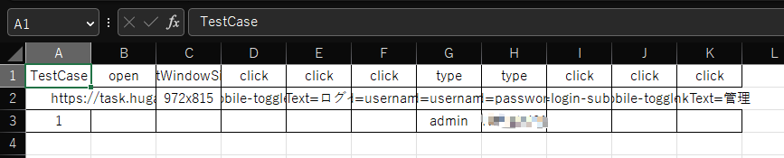

##                        

the xlsx seems like below:

the first column is the test case number, the test-data collections are from the second column.

every test data contains data structure

- command
- target
- value

| command type         | target                                                          | value                                                                                                             |
|----------------------|-----------------------------------------------------------------|-------------------------------------------------------------------------------------------------------------------|
| open                 | url                                                             | open url,skip when empty                                                                                          |
| click                | page element, use id, css,linkText, xpath,selector to choose it | click page element,skip when empty                                                                                |
| type                 | page element                                                    | type values to page input element   ,skip when empty                                                              |
| select               | page element                                                    | select value skip when empty                                                                                      |
| sleep                | -                                                               | the milliseconds to sleep                                                                                         |
| screenshot           | current page name                                               | number of screenshot   if the page is too long, it will page down and take again when the number bigger then 1 |
| setWindowSize        | window size that want to change                                 | skip when empty                                                                                                   |
| sendKeys             | page element                                                    | send key to page element,skip when empty                                                                          |
| run                  | command, bat file or sh file                                    | skip when empty                                                                                                   |
| waitForText          | page element                                                    | wait the element's text to be the value, skip when empty                                                          |
| setProperty          | type,now only support json string                               | json type properties, skip when empty                                                                             |
| setElementToProperty | page element                                                    | property key which to be set, skip when empty                                                                     |
| readProperties       | type,now only support json file                                 | json file type properties, skip when empty                                                                        |
| saveProperties       | file name                                                       | keys which contain in properties map, split by ',', skip when empty                                               |
